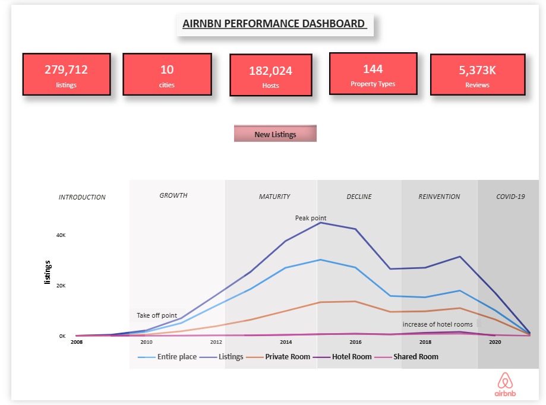
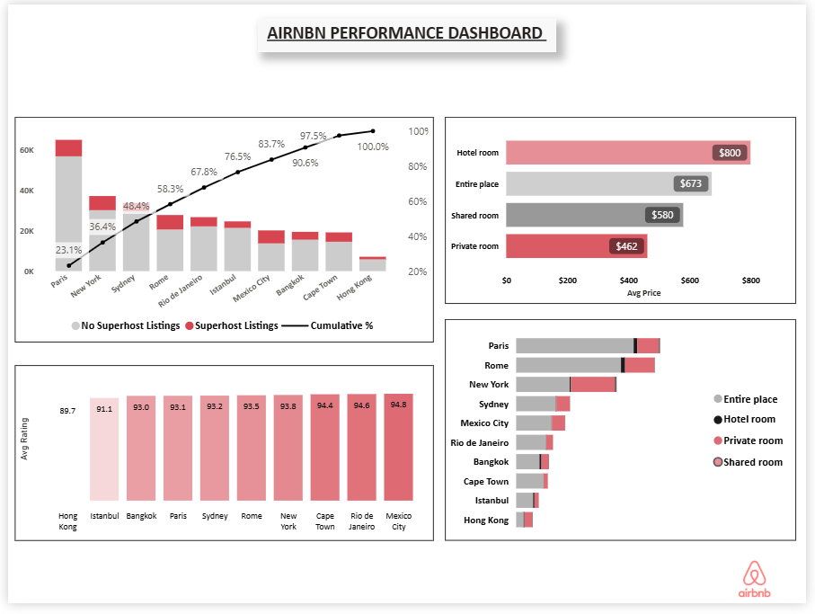

🏡 **Airbnb Data Analysis & Performance Dashboard**
 
🌍 **About Airbnb**

Airbnb is a global online marketplace that connects hosts offering accommodations with travelers seeking short-term stays. It provides various options such as entire homes, private rooms, and shared spaces across cities worldwide. It has transformed the hospitality industry by enabling flexible, affordable, and diverse lodging solutions.

---
📊 **Project Overview**

This project focuses on analyzing Airbnb listing data to uncover trends, pricing patterns, and customer preferences.
The analysis is performed using data cleaning, exploratory data analysis (EDA), and interactive visualization through Power BI dashboards.

---
🎯 **Objectives**
- Analyze listing growth trends over time  
- Understand customer preferences by room type  
- Compare performance across cities  
- Evaluate pricing patterns  
- Generate business insights from data  

---
🧹 **Data Cleaning & Preparation**
- Removed missing and null values  
- Converted data types (price, numerical fields)  
- Handled duplicate records  
- Created calculated columns for analysis  
- Structured data for efficient visualization  

---
🔍 **Exploratory Data Analysis (EDA)**
- Analyzed distribution of room types  
- Identified top cities based on listings  
- Studied pricing variations across room categories  
- Examined listing trends over time  
- Evaluated host activity and review patterns  

---
🔍 **What I Analyzed**
- 📈 Listing growth trends (2008–2021)  
- 🏠 Room type demand distribution  
- 🌍 City-wise performance comparison  
- 💰 Pricing differences across room types  
- 👥 Host and review activity  

---
📌 **Key Features of Dashboard**
- 📊 KPI Metrics (Listings, Hosts, Reviews, Cities)  
- 📈 Year-wise Growth Trend  
- 🏠 Room Type Distribution  
- 🌍 City-wise Analysis  
- 💰 Pricing Insights  

---
📈 **Key Insights**
- Listings increased rapidly and peaked before COVID-19  
- Entire homes are the most preferred accommodation type  
- Hotel rooms have higher average pricing  
- Major cities dominate the Airbnb market  

---
📷 **Dashboard Preview**

🔹 Overview Dashboard

🔹 City Analysis Dashboard

---
📁**Power BI Dashboard File**
🚀 Download the interactive Power BI file here:  
👉 https://drive.google.com/file/d/1sdRLnJ5EE2dGwcKwBVpfkJwk0vO9PThk/view?usp=sharing  

💡 Note: File hosted on Google Drive due to GitHub size limitations.

---
🚀 **How to Use**
1. Download the `.pbix` file  
2. Open in Power BI Desktop  
3. Explore dashboard 

---
💡 **Skills Demonstrated**
- Data Cleaning & Transformation  
- Exploratory Data Analysis (EDA)  
- Data Visualization  
- Dashboard Design  
- Business Insight Generation  

---
👩‍💻 Author
**Anjali Yadav**  
Aspiring Data Analyst  
 
